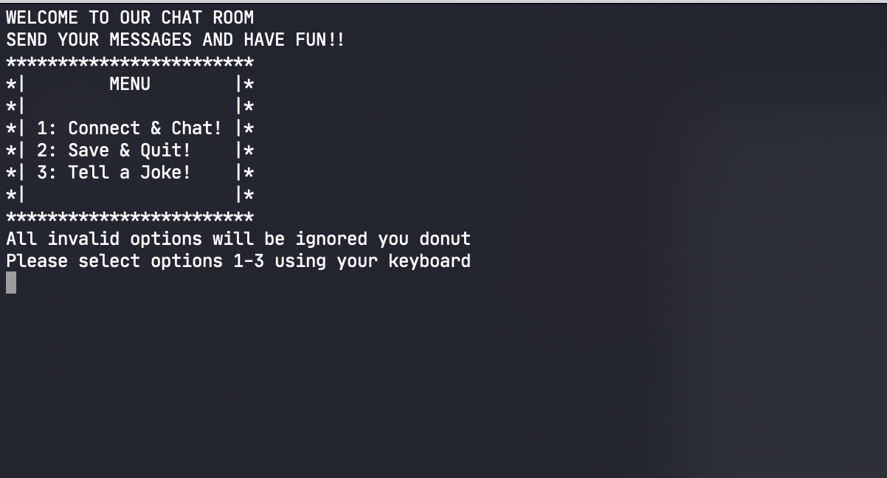

<!--
Hey, thanks for using the awesome-readme-template template.  
If you have any enhancements, then fork this project and create a pull request 
or just open an issue with the label "enhancement".

Don't forget to give this project a star for additional support ;)
Maybe you can mention me or this repo in the acknowledgements too
-->
<div align="center">

  <h1>:snake: p2py :snake:</h1>
  
  <p>
    A(n) (IP) Peer-to-Peer Chat Application written in Python for EC530
  </p>
  
</div>


<!-- Table of Contents -->
# :notebook_with_decorative_cover: Table of Contents

- [:notebook_with_decorative_cover: Table of Contents](#notebook_with_decorative_cover-table-of-contents)
  - [:star2: About the Project](#star2-about-the-project)
    - [:camera: Screenshots](#camera-screenshots)
    - [:dart: Features](#dart-features)
  - [:toolbox: Getting Started](#toolbox-getting-started)
    - [:bangbang: Prerequisites](#bangbang-prerequisites)
    - [:running: Run Locally](#running-run-locally)
  - [:compass: Roadmap](#compass-roadmap)
  - [:gem: Acknowledgements](#gem-acknowledgements)

  

<!-- About the Project -->
## :star2: About the Project

The goal of this EC530 project "hackathon" was to understand how P2P networks function, and use that knowledge to create a P2P chat application that is able to send and receive messages over networks.

More information can be found [here](https://docs.google.com/presentation/d/1abC3gaqgNzYtCQxYuvATGqdxt4zt9GU_XAmyPMJ8on4/edit#slide=id.gce96e2614d_0_60)

<!-- Screenshots -->
### :camera: Screenshots

Terminal Screengrab:
<div align="center"> 
  
</div>

Log File example:
<div align="center"> 
  
</div>

<!-- Features -->
### :dart: Features

- Asynchronus Peer-to-Peer chat over LAN
- Auto-saved, timestamped chat logs
- Built-in joke-teller :)


<!-- Getting Started -->
## 	:toolbox: Getting Started

<!-- Prerequisites -->
### :bangbang: Prerequisites

This project uses PIP as package manager, it is recommended that you use a [VirtualEnv](https://docs.python.org/3/library/venv.html) for this app!

Please esnure you have Python version 3.9.10 or greater (and the latest version of pip)!

Tested on MacOS Big Sur and Windows 10

   
<!-- Run Locally -->
### :running: Run Locally

Clone the project

```bash
  git clone https://github.com/derekbarbosa/P2Py
```

Go to the project directory

```bash
  cd P2Py
```

Install dependencies via the requirements.txt file provided
```bash
 pip install -r requirements.txt
```

Start the application

```bash
  python app.py
```

<!-- Roadmap -->
## :compass: Roadmap

* [x] Terminal UI
* [x] Localized .txt log files with date-time timestamps
* [x] Encoded TCP messages with appended local hostname and local date-time
* [x] Creation and Clean-up of localized user objects
* [ ] Centralized "IP Table" to view who is open to chatting (stretch goal)


<!-- Acknowledgments -->
## :gem: Acknowledgements

Some incredible resources everyone should check out ;) 
 - [P2P Networking](https://link.springer.com/content/pdf/10.1007/s42979-020-00315-8.pdf)
 - [Python Sockets](https://realpython.com/python-sockets/)
 - [Awesome README](https://github.com/matiassingers/awesome-readme)
 - [Emoji Cheat Sheet](https://github.com/ikatyang/emoji-cheat-sheet/blob/master/README.md#travel--places)
 - [Readme Template](https://github.com/othneildrew/Best-README-Template)

